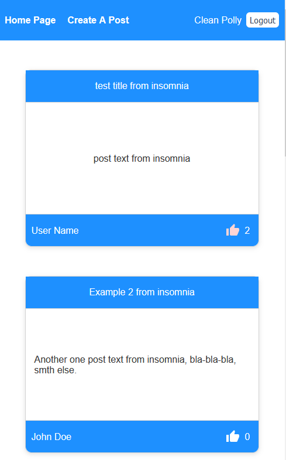

// "Ctrl" + "Space" → code // shortcut

# init client side

```javascript
mkdir client
cd cli + "Tab" → client
type nul > README.md
npx create-react-app .
```

### client side API request

```javascript
npm i axios
```

### add post render with basic css


### add react-router-dom

```javascript
npm i reacr-router-dom
```

### check links


### add formik

```javascript
npm i formik
```


### add yup form validator

```javascript
npm i yup
```


### post params

```javascript
/* rafce */
import React from "react";
import { useParams } from "react-router-dom";

const Post = () => {
  let { id } = useParams();
  console.log("id", id);
  return (
    <div>
      <h1 style={{ textAlign: "center" }}>Post: {id}</h1>
    </div>
  );
};

export default Post;
```


### get post id fom db


### get single post from db


<!-- Shift + Alt + A → Alt + 26 → Ctrl + Space → code -->

### add comment section with logic & styles


### add registration


### add authorship for comments


### check access token(wierd?)


### add likes functionality


### add material ui

```javascript
npm install @mui/material @emotion/react @emotion/styled --legacy-peer-deps
npm install @mui/icons-material --legacy-peer-deps
```


### colorize liked post with page update



### delete post functionality


### add profile card


