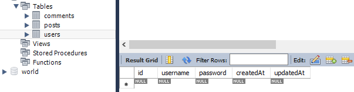

# backend side

```javascript

mkdit server
cd ser + TAB
type nul > README.md
npm init -y
npm i express cors mysql2 nodemon sequelize sequelize-cli
npx sequelize init // or npm install sequelize-cli -g

```

# create db with workbench

// shortcuts for .md → "Ctrl" + "Space" → code

```javascript
DBname: tutorDB;
npm i dotenv // CHECK THIS: 'model→index.js→".js→.json"'
```

### init repo

```javascript
git init
git add .
git commit cm "first commit"
git remote add origin git@github.com:viktishchenko/MySQL-CRUD2.git
git push origin master

```

### create post


### get all posts


### add comment db & route

### add users model



### add bcript library

```javascript
npm i bcrypt
```

### add auth logic


### check user/password


### add jwt

```javascript
npm i jsonwebtoken
```


### add likes db model & route


### add likeArray to the Post


### get user info


### users posts


